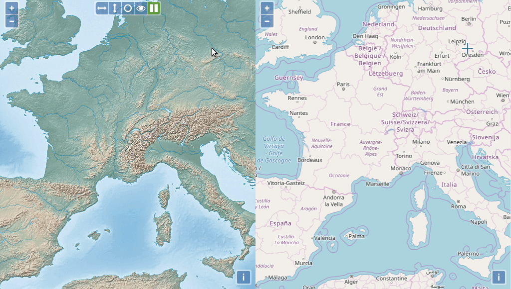

# ol-comparison-tools



An Openlayers extension adding a control to handle comparison tools between 2 layers.
To make it works, it needs font-awesome css, so add:
```
 <link rel="stylesheet" href="//maxcdn.bootstrapcdn.com/font-awesome/4.7.0/css/font-awesome.min.css">
```
to your HTML page.

To browse examples,

* install dependencies with `npm install`
* start a web server with `npm run serve` and browse http://localhost:8080/examples/example.html.

To run tests, either do `npm run test` or start a web server and browse http://localhost:8080/test/TestRunner.html file.

If you want to hack/modify the plugin, you can rebuild it doing `npm run build`.